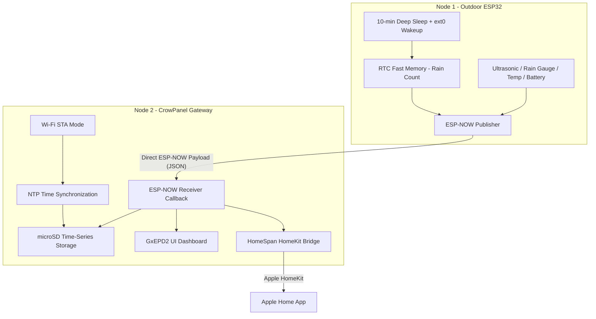

# Cistern Water Level Monitor - Technical Implementation Plan

This document outlines the technical design and phased implementation plan for the cistern water level monitoring system. The system consists of two primary nodes:
1. **Node 1 (Outdoor Publisher):** ELEGOO ESP32 Development Board, battery/solar-powered, JSN-SR04T ultrasonic sensor, MISOL tipping bucket rain gauge, and DS18B20 1-Wire temperature sensor.
2. **Node 2 (Indoor Subscriber / Gateway):** ELECROW CrowPanel 5.79" E-Ink Display (ESP32-S3), mains-powered, with an integrated SPI MicroSD card slot and home Wi-Fi connectivity.

---

## Technical Architecture & Communication Flow



---

## User Review Required

Please review the following architectural decisions and verify if they align with your physical hardware layout:

> [!IMPORTANT]
> **Gateway Strategy:** Node 1 (Outdoor) will run in deep sleep mode to conserve battery. It will not connect to Wi-Fi. It will wake up for less than 1 second, broadcast sensor data via ESP-NOW, and go back to sleep. Node 2 (Indoor Display) is permanently connected to Wi-Fi and power, running the **HomeKit (HomeSpan) gateway** and **NTP clock sync**, ensuring your Apple Home App is always responsive.

> [!WARNING]
> **Rain Gauge Pin and Awake Logic:** Pin 27 will be configured as an `ext0` wake-up trigger. When the tipping bucket tips, the mechanical switch closes, pulling Pin 27 to GND (or 3.3V). The ESP32 wakes up instantly, increments a rain counter in RTC memory (which survives sleep), and immediately goes back to sleep. This takes ~50ms, meaning it won't impact battery life significantly.

---

## Open Questions for Calibration

To ensure the display shows highly accurate gallon and percentage readings, we need to calibrate the sensor depth translation. Please provide the approximate dimensions of your cistern:

1. **Empty Distance ($D_{\text{empty}}$):** What is the distance in cm from the ultrasonic sensor face to the bottom of the cistern? (i.e., sensor reading when cistern is 0% empty/dry).
2. **Full Distance ($D_{\text{full}}$):** What is the distance in cm from the ultrasonic sensor face to the water surface when the cistern is 100% full? *(Note: The JSN-SR04T has a physical blind spot of ~20-25cm, so the full distance should ideally be greater than 25cm).*
3. **Cistern Capacity:** Is your cistern exactly 1,825 gallons (as mock-coded) or a different volume?
4. **Rain Gauge Scale:** How many mm of rain does one physical tip of your MISOL bucket represent? (Standard is usually `0.2794 mm` or `0.2 mm` per tip. Check your bucket's manual if available).

---

## Proposed Changes

We will perform changes in four distinct, highly isolated phases.

---

### Component 1: Node 2 - Indoor Display & Gateway (`/Users/jcachat/code_sandbox/cistern-water-level-monitor-eink-display`)

We will modify Node 2 first so that it is ready to receive data, sync time, and log to the SD card before we build the outdoor sensor.

#### [MODIFY] [platformio.ini](file:///Users/jcachat/code_sandbox/cistern-water-level-monitor-eink-display/platformio.ini)
* Add `bblanchon/ArduinoJson` library dependency for parsing incoming sensor payloads.
* Add `homespan/HomeSpan` library dependency for HomeKit support.
* Add `SD` library for microSD card logging (built into Espressif32 framework).

#### [MODIFY] [src/main.cpp](file:///Users/jcachat/code_sandbox/cistern-water-level-monitor-eink-display/src/main.cpp)
* **ESP-NOW Receiver Setup:** Configure ESP32 Wi-Fi in `WIFI_AP_STA` mode (needed for simultaneous HomeSpan Wi-Fi connectivity and ESP-NOW reception). Initialize ESP-NOW and register a receive callback function to parse the incoming JSON payload:
  ```json
  {"distance": 42.1, "battery": 95.0, "temp": 18.5, "rain": 3}
  ```
* **Time Sync (NTP):** Configure NTP client to fetch local time via home Wi-Fi and maintain standard local time offsets.
* **microSD Storage Integration:**
  * Initialize the SPI SD card slot using the CrowPanel pins (MISO: 38, MOSI: 41, SCK: 40, CS: 39).
  * Write records to a `cistern_history.csv` file in a time-series format:
    `Timestamp, Distance_cm, Gallons, Percentage, Battery_pct, Temp_c, Rain_tips`
  * Add logic to read history on boot to populate the 7-day trend arrays (`trend[7]` and `rain[7]`) for the right panel chart.
* **HomeSpan HomeKit Bridge:**
  * Implement three HomeKit Services:
    1. **Water Level Sensor** (reports current depth percentage)
    2. **Temperature Sensor** (reports cistern water/air temperature)
    3. **Battery Service** (reports outdoor unit battery percentage and low battery state)

---

### Component 2: Node 1 - Outdoor Sensor Node (`/Users/jcachat/code_sandbox/cister-water-level-monitor`)

#### [MODIFY] [platformio.ini](file:///Users/jcachat/code_sandbox/cister-water-level-monitor/platformio.ini)
* Add `paulstoffregen/OneWire` and `milesburton/DallasTemperature` library dependencies for the DS18B20 sensor.
* Add `bblanchon/ArduinoJson` library to format outgoing JSON payloads.

#### [MODIFY] [src/main.cpp](file:///Users/jcachat/code_sandbox/cister-water-level-monitor/src/main.cpp)
* **RTC RAM Variables:** Move the cumulative rain gauge tip counter and state to RTC slow memory so they survive deep sleep cycles:
  ```cpp
  RTC_DATA_ATTR int rtcRainTipCount = 0;
  ```
* **Wakeup Source Detection:**
  * Check the wake-up cause on boot using `esp_sleep_get_wakeup_cause()`.
  * **If wake-up was caused by Pin 27 (Rain Gauge):** Increment `rtcRainTipCount`, perform a brief software debounce (ignore within 50ms), and immediately go back to sleep. Do *not* turn on the ultrasonic sensor or Wi-Fi transmitter, preserving battery.
  * **If wake-up was caused by the 10-minute timer (or boot/reset):** 
    1. Power up and read the JSN-SR04T ultrasonic sensor.
    2. Read the DS18B20 temperature sensor on Pin 17.
    3. Read the battery telemetry via Pin 34 (analog read).
    4. Compile the JSON payload, including the accumulated `rtcRainTipCount`.
    5. Transmit via ESP-NOW to Node 2's MAC address.
    6. Reset the `rtcRainTipCount` in RTC memory (or keep it as a rolling total, according to calibration preferences).
    7. Return to deep sleep.

---

## Verification Plan

### Automated & Compilation Tests
- Propose compilation commands (`pio run`) on the workspace terminal for both repositories to ensure libraries are correctly linked and code compiles without errors.

### Manual Verification Flow
1. **Node 2 Console Verification:**
   - Compile and flash Node 2. Open the platformio device monitor (`pio device monitor`).
   - Verify Wi-Fi connects, local time syncs via NTP, and HomeSpan starts up.
   - Verify the microSD card initializes and prints a confirmation.
2. **ESP-NOW Broadcast Simulation:**
   - We will write a lightweight mock script or flash Node 1 to send fake sensor data to Node 2.
   - Check Node 2's serial console to confirm the JSON parses correctly and is written to the microSD card.
   - Verify the display updates with the mock values.
3. **Physical Circuit Testing (By User):**
   - Place Node 1 on the breadboard.
   - Manually trigger the rain gauge tipping bucket and verify on Node 1's serial monitor that it wakes up and increments the RTC RAM count.
   - Connect the DS18B20 with a 4.7kΩ pull-up resistor on Pin 17, and check that the temperature reading is accurate.
   - Check the physical battery voltage with a multimeter at the center divider junction to confirm it is <3.3V before connecting it to Pin 34.
